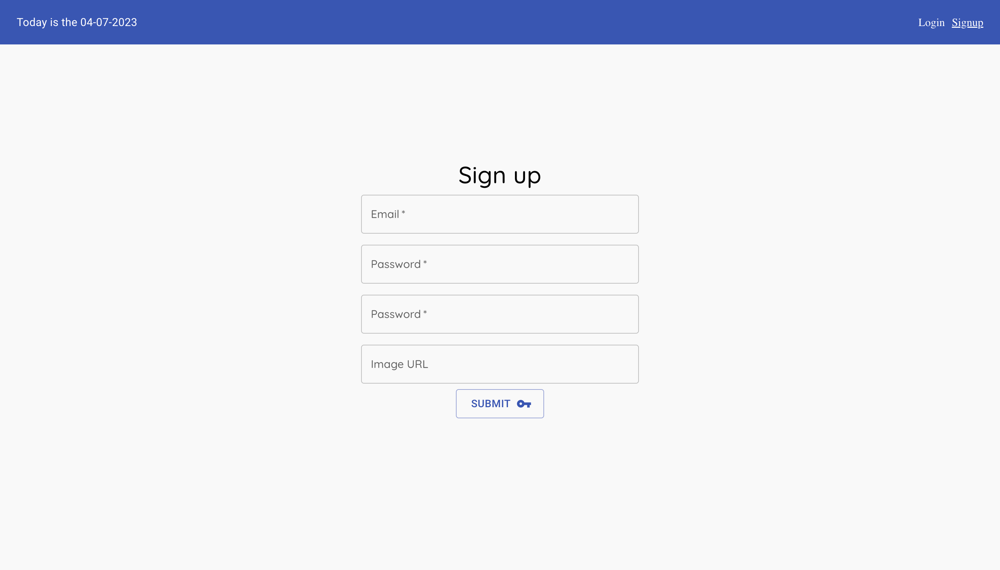
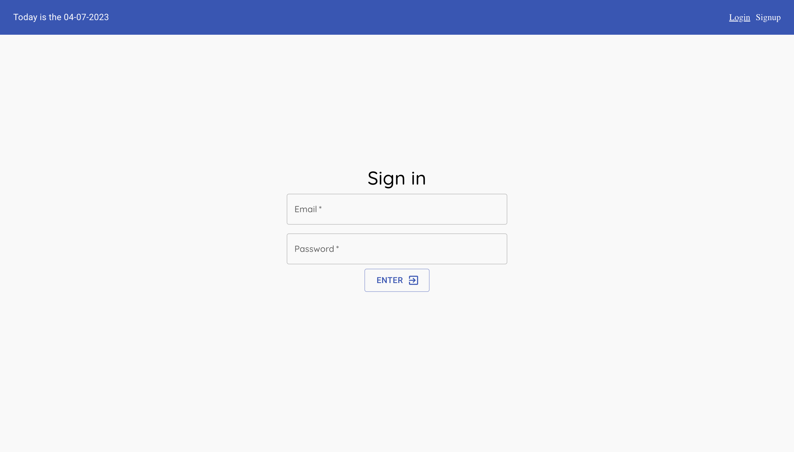
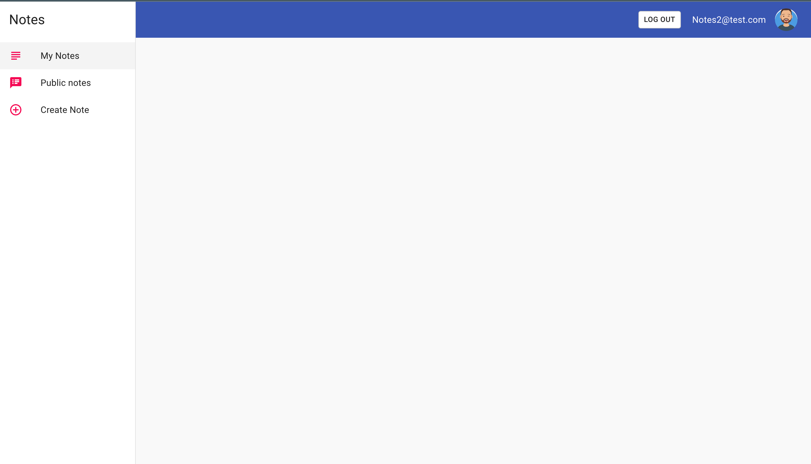
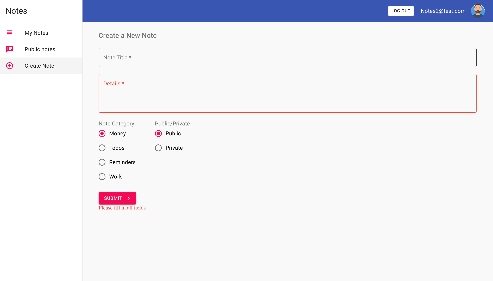
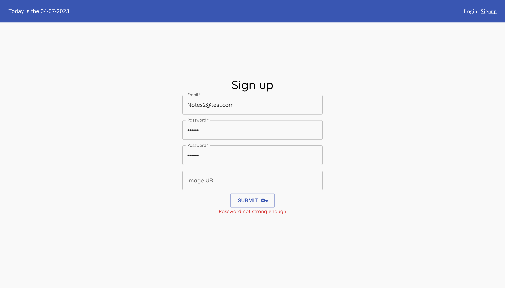
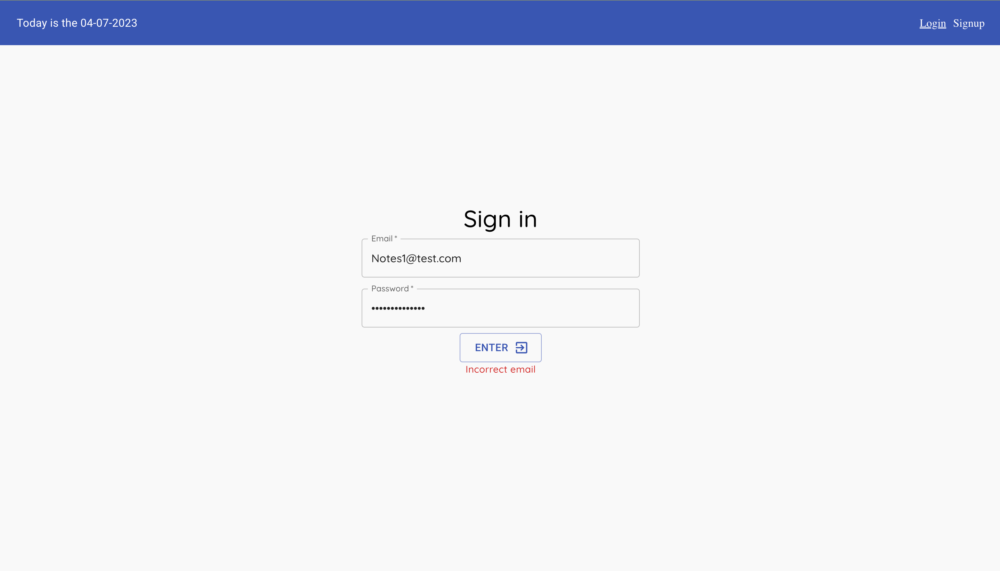
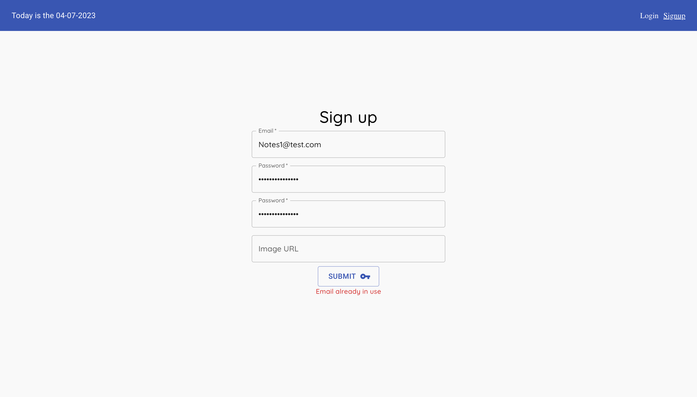

# mern_mui
# Images

/// Sign up \\\

/// Sign In \\\

/// My notes \\\

/// Public Notes\\\

![](finalPictures/PublicNotes.png

/// Create Note \\\

/// about \\\

"Notes" is a user-friendly and intuitive web-based platform designed for note-taking and organization. With its clean and minimalist design, the website offers a distraction-free environment for users to focus on their notes and tasks.

Upon visiting the website, users are greeted with a simple and straightforward interface. They have the option to either log in if they already have an account or sign up to create a new account. The login page ensures that only authorized users can access their personal notes and information.

Once logged in, users are directed to the "My Notes" page, where they can view and manage their saved notes. The page is organized in a visually appealing manner, with each note displayed as a card containing the title and a brief preview of the content. Users can easily navigate through their notes using the search bar or filter them based on categories.

The website offers four categories for organizing notes: todos, money, reminders, and work. This categorization system allows users to easily group their notes based on the type of information they contain. For example, users can create a todo list for their daily tasks, track their expenses under the money category, set reminders for important events, and keep track of work-related notes.

One of the key features of "Notes" is the ability to choose whether a note is public or private. This feature allows users to control the visibility of their notes. If a note is set as public, it will be displayed on the "Public Notes" page, where other users can view and interact with it. This creates a collaborative environment where users can share ideas, tips, or insights with others. On the other hand, if a note is set as private, it remains visible only to the creator.

To further enhance customization, the website allows users to personalize the appearance of their notes. Users can choose from a variety of fonts, colors, and backgrounds to make their notes visually appealing and reflect their personal style. This feature adds a touch of creativity and personalization to the note-taking experience.

The website also offers a convenient syncing feature, ensuring that users can access their notes from any device with an internet connection. This allows users to seamlessly switch between their computer, tablet, or smartphone without losing any important information. The synchronization ensures that users can stay productive and organized regardless of the device they are using.

In terms of security, "Notes" prioritizes the privacy and confidentiality of its users' notes. The website implements strong encryption measures to protect sensitive information and offers optional password protection for individual notes or the entire account. This ensures that users can trust the platform with their personal and valuable data.

Additionally, the website allows users to delete old notes if they wish to declutter their collection or remove any outdated information. This feature promotes organization and helps users maintain a clean and efficient note-taking experience.

In conclusion, "Notes" is a reliable and efficient web-based note-taking solution that simplifies the process of organizing and managing information. With its user-friendly interface, convenient features such as categorization, customization, and syncing, and strong emphasis on privacy and security, it is an ideal platform for individuals seeking a digital space to capture and store their ideas, tasks, and important details. Whether it's for personal use or collaboration with others, "Notes" provides a seamless and intuitive note-taking experience.

/// Errors \\\

